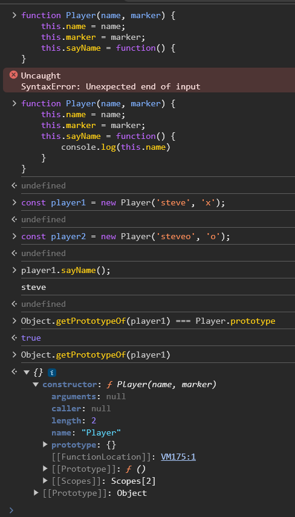

# Table of Contents
1. [Objects and Object Constructors](#objects-and-Object-constructors)
    - [Object Literals](#object-literals)
    - [Object Constructor](#object-constructor)
    - [Exercise](#exercise)


<hr/><hr/>

## Objects and Object Constructors

### Object Literals

Definition:

    An object literal is a simple and concise way to create objects using a comma-separated list of key-value pairs wrapped in curly braces {}.

```js
const person = {
  name: 'John',
  age: 30,
  greet: function() {
    console.log('Hello, ' + this.name);
  }
};

```

### Object Constructor

Definition:

    An object constructor is a special function that allows you to create and initialize objects with a shared structure and behavior.
    It is typically defined using a function that capitalizes its name to denote that it is a constructor.

Syntax:

```js
function Person(name, age) {
  this.name = name;
  this.age = age;
  this.greet = function() {
    console.log('Hello, ' + this.name);
  };
}

const john = new Person('John', 30);
const jane = new Person('Jane', 25);
```

- Useful when you have a specific type of object that you need to duplicate. An object constructor is a fucntion like:
```js
function Player(name, marker) {
  this.name = name;
  this.marker = marker;
}
```

- which you use by calling the function with the keyword `new`

```js
const player = new Player('steve', 'X');
console.log(player.name); // 'steve'
```

- And just like w/ objects created using the Object Literal Method, you can add funcitons to the object

- Just like with objects created using the Object Literal method, you can add functions to the object:

```js
function Player(name, marker) {
  this.name = name;
  this.marker = marker;
  this.sayName = function() {
    console.log(this.name)
  };
}

const player1 = new Player('steve', 'X');
const player2 = new Player('also steve', 'O');
player1.sayName(); // logs 'steve'
player2.sayName(); // logs 'also steve'
```

### Exercise

`Write a constructor for making “Book” objects. We will revisit this in the project at the end of this lesson. Your book objects should have the book’s title, author, the number of pages, and whether or not you have read the book. Put a function into the constructor. See book-exercise.ts`

### The Prototype

Definition:

    All objects in Javascript have a `prototype`. The `prototype` is another object that the original object inherits from, which is to say, the original object has access to all of its `prototype's` methods an properties.


- Let's try out prototypes by getting the prototype of our player objects from earlier in the browser's dev console. 
  - be sure you create the play1 and play2 objects before!

  

- …that the original object inherits from, and has access to all of its prototype’s methods and properties:
  - As said in the earlier point, every Player object has a value which refers to Player.prototype. So: Object.getPrototypeOf(player1) === Object.getPrototypeOf(player2) (returns true).
  - So, any properties or methods defined on Player.prototype will be available to the created Player objects!
- Here's a cool summary of prototypal inheritance:
  - Is the `.valueOf` function part of the `player1` object? No, it is not. (Remember, only the `name`, `marker` and `sayName` properties are part of the `Player` objects.)
  - Is the function part of the `player1’s` prototype (the `Object.getPrototypeOf(player1)` value, i.e., `Player.prototype`)? No, only the `.sayHello` function is a part of it.
  - Well, then, is it part of `Object.getPrototypeOf(Player.prototype)` (=== `Object.prototype`)? Yes, `.valueOf` is defined on `Object.prototype`!
<hr/>